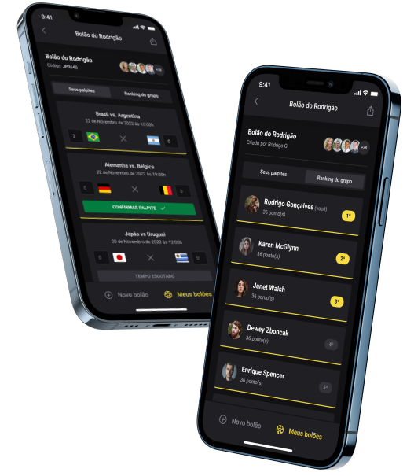

<h1 align="center">
    
</h1>

<p align="center">
  
</p>

## 🚀 Tecnologias

Esse projeto foi desenvolvido com as seguintes tecnologias:

- [Typescript](https://www.typescriptlang.org/)
- [Node.js](https://nodejs.org/en/)
- [React](https://reactjs.org)
- [Next](https://nextjs.org/)
- [React Native](https://facebook.github.io/react-native/)
- [Expo](https://expo.io/)

## 💻 Projeto

Projeto resultado do Next Level Week 10 trilha Ignite pela [Rocketseat](https://www.rocketseat.com.br/). <br>
O bolão da copa é uma forma divertida de realizar os palpites dos jogos da copa com os amigos.

## :fire: Como usar

- ### **Pré-requisitos**

  - É **necessário** possuir o **[Node.js](https://nodejs.org/en/)**
  - É **necessário** possuir o **[NPM](https://www.npmjs.com/)**.

1. Faça um clone :

```sh
  $ git clone https://github.com/PanzariniDaniel/bolao-copa.git
```

2. Executando a Aplicação:

- ## Server

```sh
  # Instale as dependências
  $ cd server
  $ npm install

  # Crie o banco de dados
  $ npx prisma:migrate dev

  # Inicie a API
  $ npm run dev
```

- ## Web
```sh
  # Instale as dependências
  $ cd web
  $ npm install

  # Inicie o projeto web
  $ npm run dev
```

- ## Mobile
```sh
  # Instale as dependências
  $ cd mobile
  $ npm install

  # Inicie o projeto mobile
  $ npm start
```

## :hand: Atenção

- Lembre-se de criar as variáveis de ambiente como nos exemplos de cada projeto;
- Para rodar o projeto web pode ser que seja preciso comentar o trecho host (como no exemplo abaixo) dentro do arquivo server/src/server.ts
- Para rodar o projeto mobile não precisa comentar nada
```sh
  await fastify.listen({ port: 3333, /**host: "0.0.0.0"**/ });
```


## 🤔 Como contribuir

- Faça um fork desse repositório;
- Cria uma branch com a sua feature: `git checkout -b minha-feature`;
- Faça commit das suas alterações: `git commit -m 'feat: Minha nova feature'`;
- Faça push para a sua branch: `git push origin minha-feature`.

Depois que o merge da sua pull request for feito, você pode deletar a sua branch.

## :memo: Licença

Esse projeto está sob a licença MIT. Veja o arquivo [LICENSE](LICENSE.md) para mais detalhes.

---
